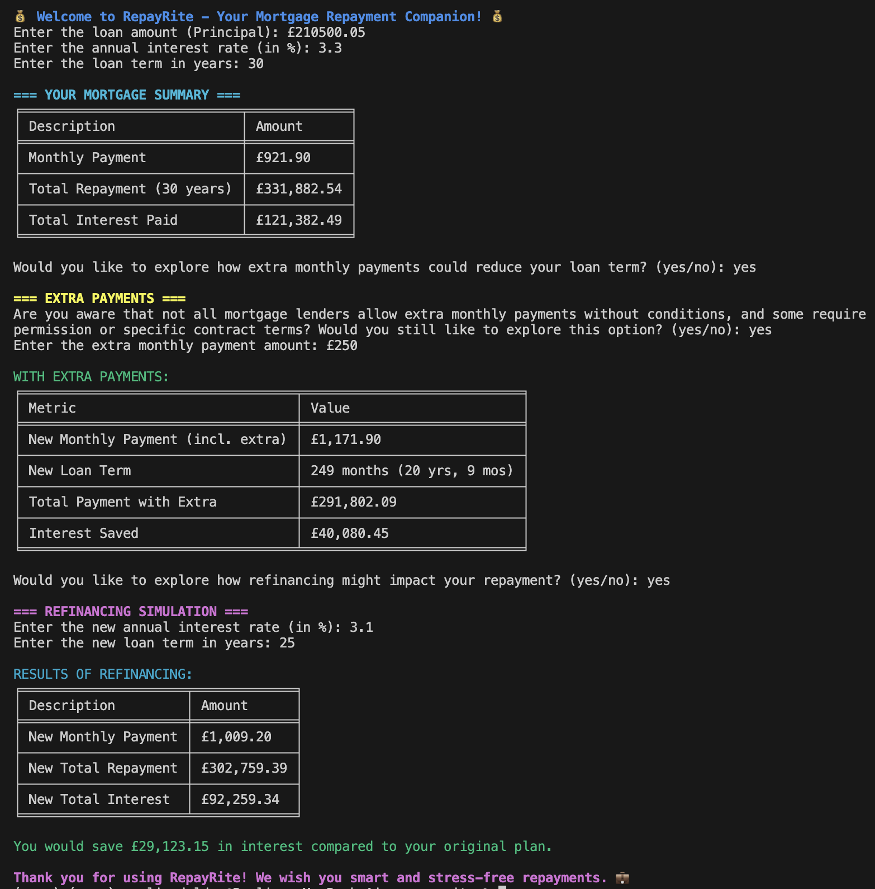
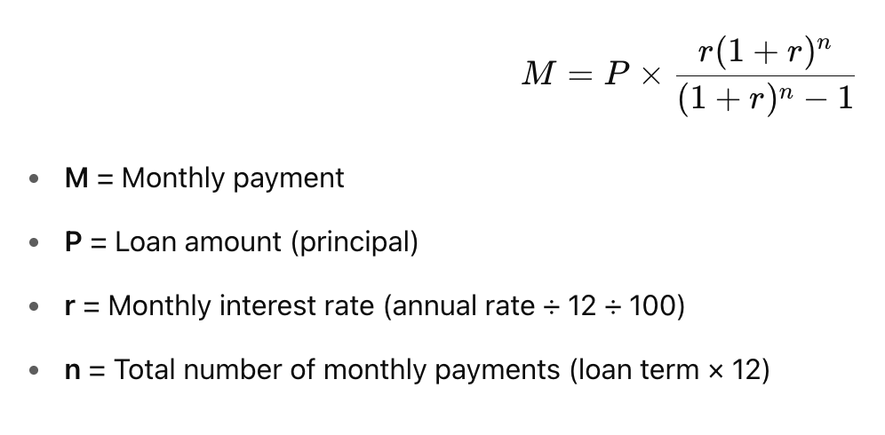
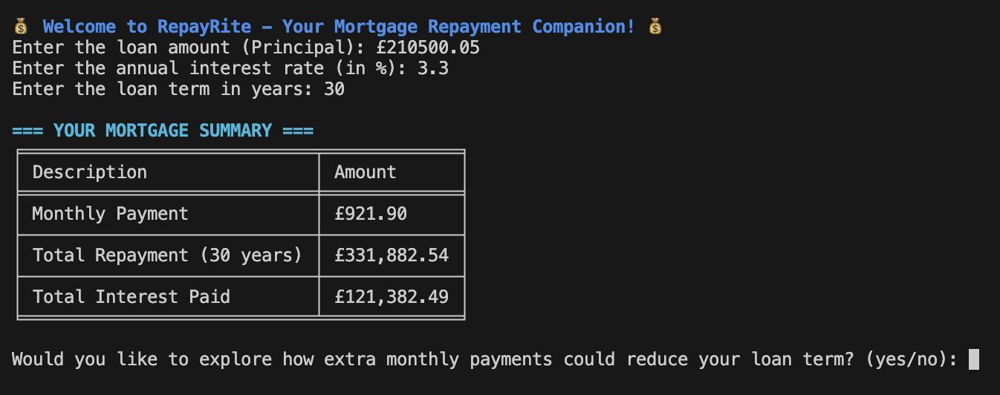
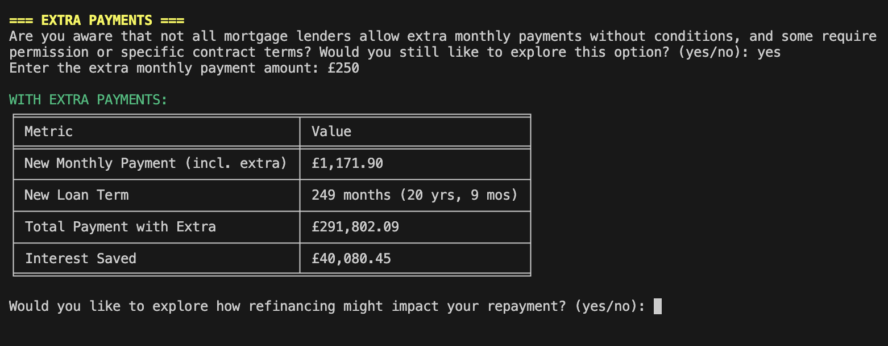
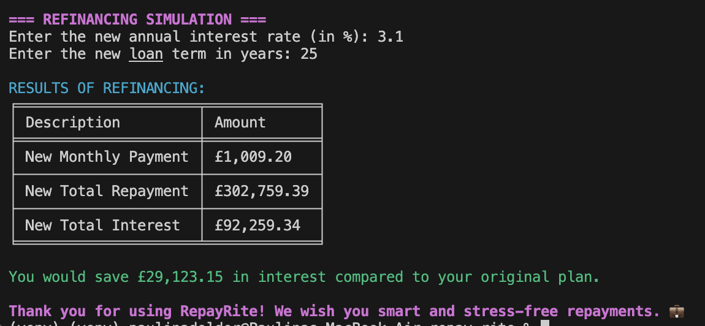
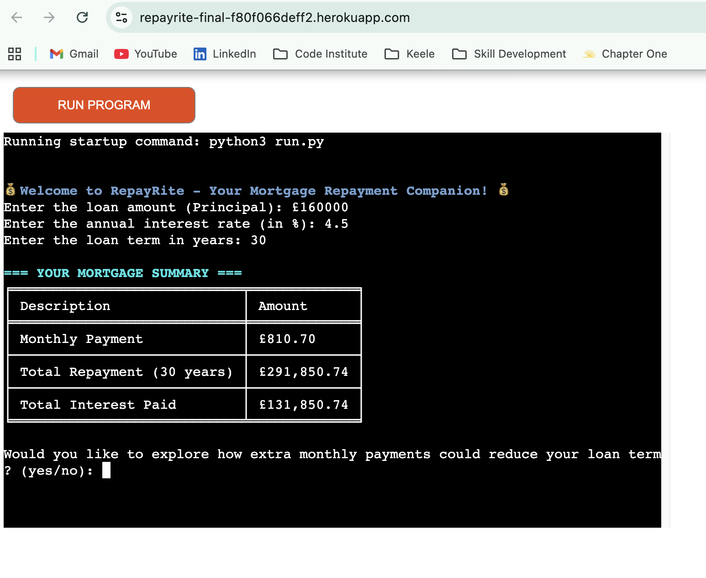
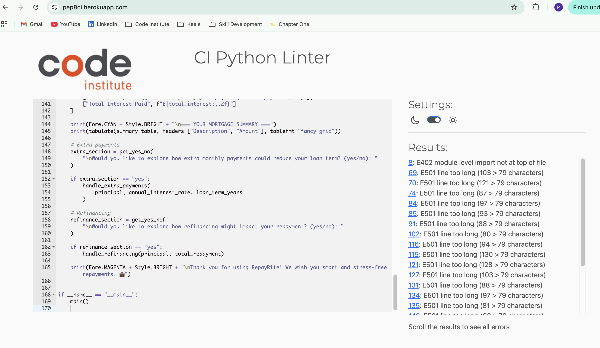

# RepayRite

RepayRite is a mortgage repayment calculator designed to help users understand the financial impact of their mortgage decisions. The application allows users to calculate standard repayments, simulate extra monthly payments, and explore refinancing scenarios.

Originally developed as a Python command-line application, the project was later adapted into a browser-accessible web application using a Node.js wrapper and deployed to Heroku.

Live application:
https://repayrite-final-f80f066deff2.herokuapp.com/

## UX

RepayRite is designed to be simple, informative, and transparent. The interface guides users step-by-step through mortgage calculations, presenting results in a clear and structured format. The below mortgage formula was applied:

### Target Users

- First-time homebuyers
- Existing homeowners considering overpayments
- Borrowers exploring refinancing
- Anyone wanting clarity on mortgage costs

### User Needs Addressed

- Clear calculation of monthly repayments
- Transparency of total interest and repayment costs
- Optional exploration of overpayments and refinancing
- Simple, distraction-free interface

### Features

First the programme will take the mortgage value, interest rate and loan term to automatically produce a summary displaying monthly repayments, total amount repaid and how much of that is pure interest.

Then the user is asked whether they want to explore what these figures were to look like if extra monthly payments were made. 
If prompted, the summary table will display the new monthly figure, how this would influence the term and the total amount repaid, as well as the interest difference. Note: interest difference could be positive or negative.

User is then asked whether they would like to explore refinancing option where the new loan rate and term can be entered to manipulate the initial value of the mortgage figure. The new summary table will be updated as well as show a difference in interest at the bottom of the terminal. 

If the user does not want to use the additional calculators, they remain optional and can be skipped using input 'no'. 

If the user wants to enter a different mortgage value they have to start the programme again.

## Technologies Used

### Languages
- Python 3.12 – Core calculation logic
- JavaScript (Node.js) – Web wrapper for browser deployment

### Libraries
- colorama – Terminal styling (core logic stage)
- tabulate – Table formatting for structured output

### Deployment
- Heroku – Cloud hosting platform
- Heroku Python Buildpack
- Heroku Node.js Buildpack
- Procfile configured with: web: node index.js

## Project Evolution & Migration

The project was initially developed as a pure Python CLI application and thus did not render the web interface. During development, it was identified that the Code Institute template required a web-based deployment structure so the previous project's logic and code was migrated to this repo. The code worked, it was the lack of web interface that made it unaccessible. 

To resolve this:

- A brand new repo using the suggsted template was created.
- Each section of Python logic was carefully migrated from the original repository into the new template-based project to ensure compatibility with the required deployment structure.
- A Node.js wrapper (`index.js`) was maintained to serve the application in a browser.
- Both Python and Node buildpacks were configured in Heroku in that precise order. 
- The project was redeployed and tested to ensure full functionality in the browser environment.

This migration demonstrates adaptability, problem-solving, and deployment restructuring during development.

## Testing

Testing was conducted continuously throughout development.

### Development Testing (CodeSpaces)

- Each feature was tested immediately after implementation.
- Mortgage calculation outputs were manually verified using known financial examples.
- Edge cases tested included:
  - Zero or negative inputs
  - Non-numeric values
  - Large loan amounts
- Input validation functions were implemented to prevent crashes.
- Refinancing and extra payment scenarios were tested with multiple variations.

### Deployment Testing (Heroku)

- Initial deployment exposed configuration issues with the Procfile.
- After restructuring to use `web: node index.js`, deployment succeeded.
- The live deployed app was tested in:
  - Chrome
  - Incognito mode
  - Multiple screen sizes (best experienced on desktop for optimal readability)
- All core features were verified to work correctly in the production environment.

No runtime errors were present in Heroku logs after final deployment.

### Validator Testing

The Code Institute Python Linter was used to validate the Python files.

Minor PEP8 line-length warnings were identified due to formatted output and long prompt strings. These do not impact functionality or readability within the deployed web interface.

No syntax errors were present.

## Deployment

### Live Application

The project is deployed via Heroku and can be accessed at:

https://repayrite-final-f80f066deff2.herokuapp.com/

### Deployment Process

1. Project pushed to GitHub repository.
2. Heroku app created.
3. Python and Node.js buildpacks configured.
4. Procfile created with:

   web: node index.js

5. Environment built successfully.
6. Application tested post-deployment to confirm functionality.

### Local Deployment

To run locally:

1. Clone the repository.
2. Install dependencies:
   pip install -r requirements.txt
3. For web-based local testing (if using the Node wrapper): node index.js

### Credits 

- Code Institute for providing the foundational template
- Experian for refinancing mortgages information
- AI tools for error checking throughout the development
- Paulina Dolder, for idea conception

### Contact

If you have any questions or feedback, feel free to reach out:

- GitHub: [PaulinaD-CodeIns](https://github.com/PaulinaD-CodeIns)  
- Email: o4bhm9f4@students.codeinstitute.net
- LinkedIn: [Paulina Dolder](https://www.linkedin.com/in/paulina-dolder-065677251/)